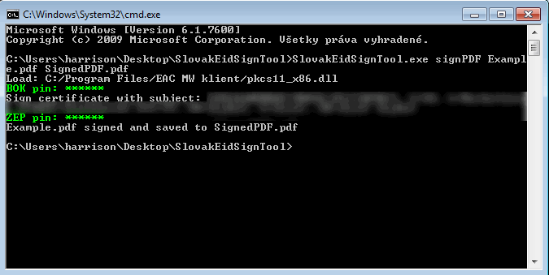
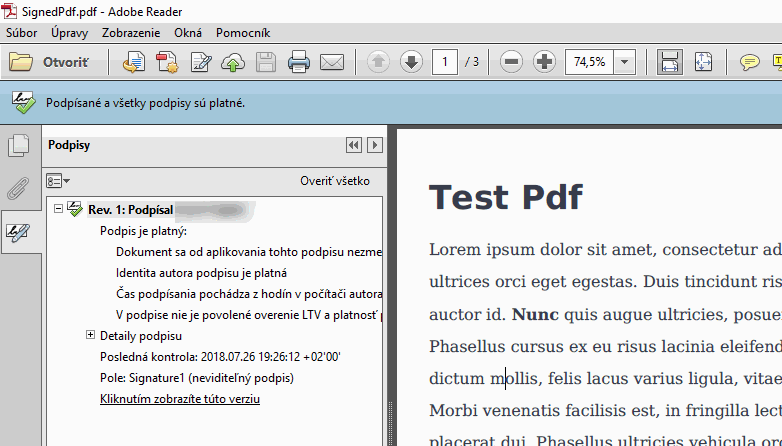

# Slovak eID Sign Tool
_Slovak eID Sign Tool_ is tool for listing certificates from Slovak eID card,
signing PDF documents with CMS signature (_adbe.pkcs7.detached_ not valid _eIDAS PAdES_)
or signing file (.txt, .pdf, .png,...) to _eIDAS CAdES-BASELINE-B ASiC-E_ container (.asice file).

This project aim to education [PKCS#11 standard](https://www.cryptsoft.com/pkcs11doc/STANDARD/pkcs-11v2-20.pdf) and document signing using _Slovak eID_.

_SlovakEidSignTool_ is example project for signing PDFs using Slovak eID (eID with _ZEP / KEP_), designed for learning.

Used:
* .Net Core 2.1 - multi-platform,
* [PKCS#11 Interop](https://pkcs11interop.net/) for communication with eID "driver" (or other hardware token),
* [iTextSharp](https://github.com/itext/itextsharp) library.
* [commandline](https://github.com/commandlineparser/commandline) for parsing command line arguments.

## Prerequisites
 * .Net Core SDK for build,
 * Slovak eID card with ZEP certificate,
 * Driver for smart card reader (from [Slovensko.sk](https://www.slovensko.sk/sk/na-stiahnutie)),
 * Application _eID klient_ (from [Slovensko.sk](https://www.slovensko.sk/sk/na-stiahnutie)).

## Usage

### Listing KEP certificates on eID
 1. Insert eID card to card reader.
 1. Run `dotnet SlovakEidSignTool.dll list`.
 1. Type BOK.

### Listing encryption and authentication certificates on eID
 1. Insert eID card to card reader.
 1. Run `dotnet SlovakEidSignTool.dll list --listEp`.
 1. Type BOK.

### Signing the Pdf file "Example.pdf"
 1. Insert eID card to card reader.
 1. Run `dotnet SlovakEidSignTool.dll signPDF Example.pdf SignedPdf.pdf`.
 1. Type BOK.
 1. Type ZEP PIN.

 ### Signing the file into the CAdES ASiC-E container
 1. Insert eID card to card reader.
 1. Run `dotnet SlovakEidSignTool.dll signCades example.txt text/plain SignedExample.asice` (signing file, mime-type of signing file, output signature file).
 1. Type BOK.
 1. Type ZEP PIN.

Example on _Windows 7_ x86 with self-contained build:





# Build

```
cd src/SlovakEidSignTool
dotnet publish -c Release
```

Or self-contained for Windows 7 (8,10..):
```
cd src/SlovakEidSignTool
dotnet publish -c Release -r win7-x86
```

Or self-contained for Ubuntu:
```
cd src/SlovakEidSignTool
dotnet publish -c Release -r ubuntu.16.10-x64
```

For more see [.NET Core RID Catalog](https://docs.microsoft.com/en-us/dotnet/core/rid-catalog).

## Read more:
 1. [PKCS#11 Interop](https://pkcs11interop.net/)
 1. [PKCS#11 X509Store](https://github.com/Pkcs11Interop/Pkcs11Interop.X509Store/blob/master/src/Pkcs11Interop.X509Store/Pkcs11X509Certificate.cs)
 1. [Signing a PDF File Using Azure Key Vault](https://rahulpnath.com/blog/signing-a-pdf-file-using-azure-key-vault/)
 1. [Slovensko.sk](https://www.slovensko.sk/sk/na-stiahnutie)
 1. [Program description in Slovak language](http://harrison314.github.io/SkEidSign.html)
 1. [Creating an ASiC-E container manually](https://github.com/difi/asic#creating-an-asic-e-container-manually)
 
## Validation services
 1. [Slovek national ZEP validator](https://www.slovensko.sk/sk/e-sluzby/sluzba-overenia-zep)
 1. [zep.disig.sk - online signer and validator](https://zep.disig.sk/Portal)
 1. [DDS validator](https://dss.agid.gov.it/validation)

